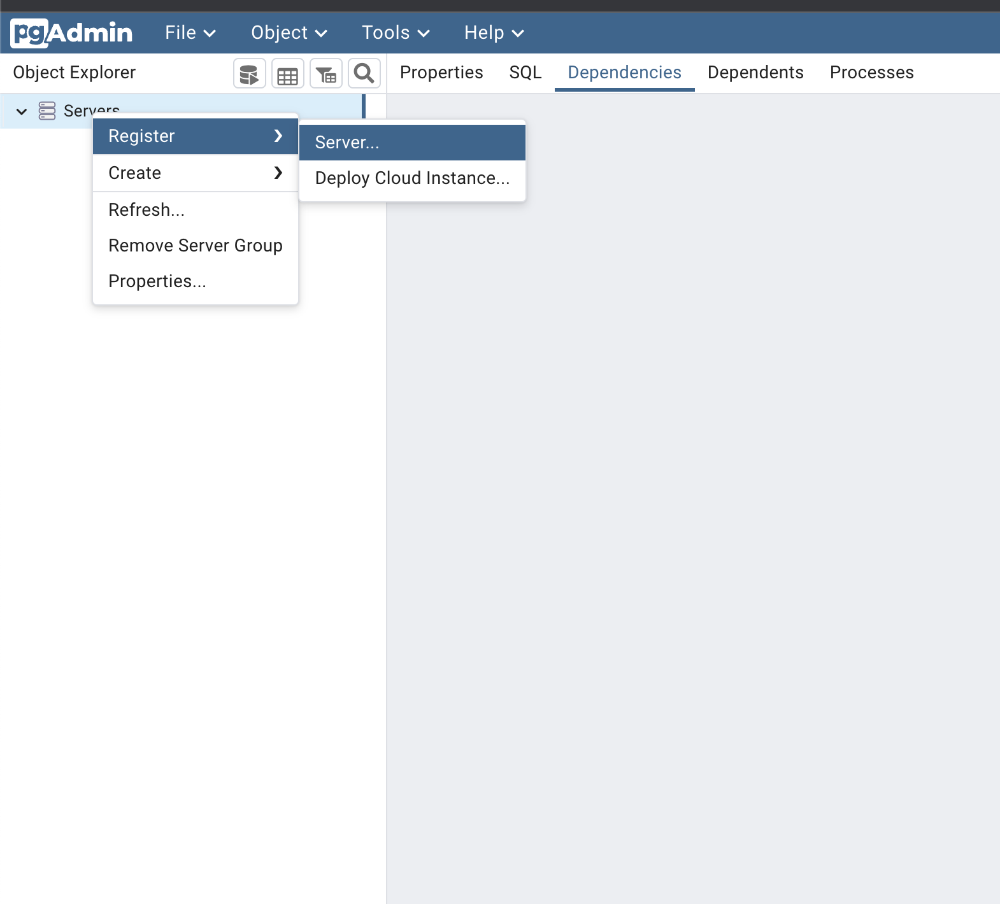
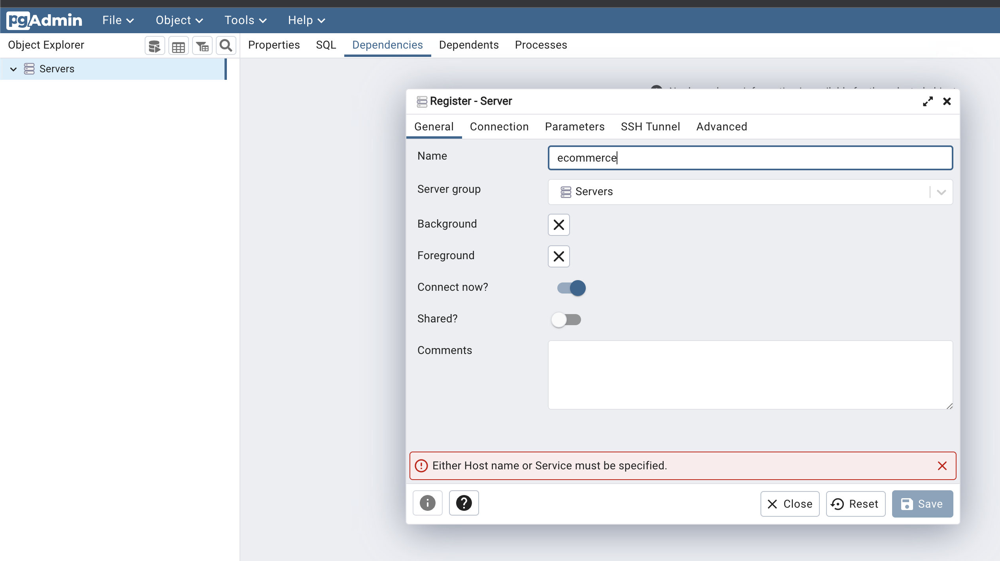
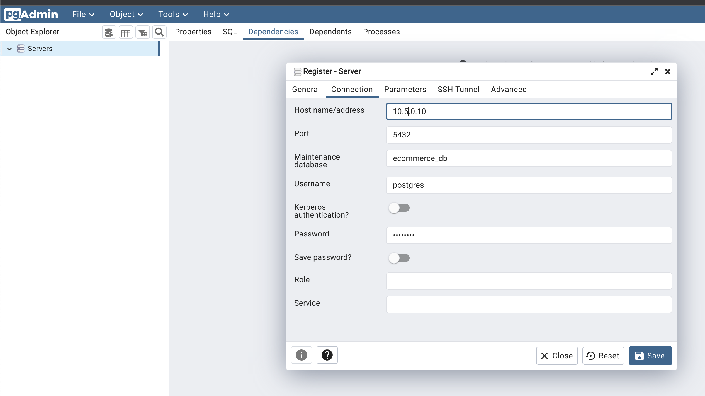

# Overview

## Running Locally

### 1. Run docker-compose:

The local database, pgAdmin, and Keycloak:

```
docker-compose -f docker-compose.yaml up
```

### 2. Configure the Database

#### Access the pgAdmin
[http://localhost:5050/browser/](http://localhost:5050/browser/)

#### Add a database connection 
to your e-commerce database:

- Your IP address: `10.5.0.10` and port: `5432` (as defined in the Docker Compose file).
- Database name: `ecommerce_db`.
- Schema (created by Flyway, not visible until Flyway is run): `app`.

**Step 1:**
  
**Step 2:**  
  
**Step 3:**  


### 3. Run the application with the `local` profile:
```
./mvnw spring-boot:run -Dspring-boot.run.profiles=local
```

## Keykloak Settings

**Important:** (To simplify development) The below config for local development is defined in the JSON file: `./config/keycloak/local-realm-export.json` and is imported during container startup. You can manually add additional users if needed.


The Docker Compose file also starts a Keycloak server for identity management:

- In the first step, you need to define: realm, user, and client ([Keycloak Getting Started Guide](https://www.keycloak.org/getting-started/getting-started-docker)).
  - **Realm:** `ecommerce-app`
  - **User:**
    - Username: `johnny.lee@mail.com`
    - Password: `s3cr3t`
    - First Name: `Johnny`
    - Last Name: `Lee`
  - **Client:** `ecommerce-app-id`  
    (The above user represents an application user, e.g., a buyer or seller.)
- All users must be created in the authorization server to allow login.

## Running for Frontend Development
Frontend development is supported by running a Webpack dev-server. 

A testing server (`server.js`) is also available to facilitate frontend development.

Additionally, a separate Keycloak instance is provided for frontend development (`frontend-dev-docker-compose.yaml`) with a `frontend-dev-realm-export` realm, pre-configured with a buyer and seller (`buyer@mail.com`, `seller@mail.com`, both with password `s3cr3t`).

### 1. Run Keycloak:

```
docker-compose -f frontend-dev-docker-compose.yaml up
```

### 2. Check `package.json` for the scripts to run.


## Running Tests
Separate containers for PostgreSQL and Keycloak are used with the help pf [Testcontainers](https://testcontainers.com), with a separate Keycloak realm imported during startup:
```
./mvnw clean test
```

## Building the JAR
To build the project JAR file:
```
./mvnw clean package
```
